# Photo takeoff: reviewable implementation

The isolated photo path now performs authenticated direct image intake, server
verification, durable per-image reading, persisted evidence and human measurement
review. It does not yet produce a sourced priced estimate: independent model
reconciliation/risk review and the composition/price join remain explicit blockers.
`missing_price` and `estimate: null` persist instead of a zero or invented total.

```mermaid
flowchart LR
  A[Authenticated project + consent] --> B[Private signed image upload]
  B --> C[MIME + bounded bytes + dimensions + SHA256]
  C --> D[Persist run, explicit provider budget, image checkpoints]
  D --> E[BullMQ photo queue]
  E --> F[Worker lease + heartbeat]
  F --> G[One configured strongest-model observation per image]
  G --> H[Saved source regions, quality, uncertainties]
  H --> I[Human reference/measurement and cross-view identity review]
  I --> J[Approved quantities; missing_price]
  J --> K[Pending independent review + sourced compositions/prices]
```

The observer selects exactly one of `gpt-6-astra`, `claude-opus-5-5` or
`gemini-3.1-pro-preview`. Selection remains configurable and requires an account,
image compatibility and reviewed maximum call-cost attestation. No cheaper model,
provider fan-out or fallback is implicit. Complementary Kimi/DeepSeek adapters
remain in the shared stage registry; the minimum photo observer does not call
them or claim the independent review has occurred.

Uploads use direct private storage PUT, outside the Vercel request body. The
server fetches only its own signed tenant path with redirects disabled, validates
bounded actual bytes, structural image framing/dimensions and stores a content hash. WebP
requires complete RIFF chunks with bounded payloads/padding, exactly one VP8/VP8L
frame, valid frame headers and matching canvas dimensions. A VP8X dimension header
alone is rejected. JPEG requires a bounded photographic 8-bit frame, scan payload
and terminal EOI; baseline and progressive fixtures are covered. PNG requires
complete chunks, nonempty IDAT and terminal IEND. Animated images are rejected.
These checks do not fully decode compressed pixels or prove visual legibility;
malformed entropy data can still require rejection by a raster decoder or provider.
No image decoding dependency was added. The
worker checks the saved revision/hash again before sending inline image bytes.
No signed storage URL, EXIF, API credential or upstream response body enters the
usage ledger/error diagnostics. Limits are eight images, 20 MB each and 40 MB per
batch, with stricter vendor bounds checked before dispatch. Large/high-detail
images may require a new cropped upload; this implementation does not silently
downsample or pretend all regions were inspected.

Each image has one paid attempt. Completed checkpoints survive restart. A lease
can resume work that never began a provider call; an interrupted `processing`
image becomes `unknown_provider_outcome` and requires reconciliation. It is not
automatically billed again. There is no total-duration limit or artificial delay.
Technical attempt timeouts and heartbeats detect stuck/cancelled work. Cancellation
fences new reservations/checkpoints and preserves already saved evidence. API
history returns metadata only and the main GET includes the result once, bounded
at 3.5 MB by the migration; it never repeats all large per-image payloads. Lazy
`GET /runs/:id?asset_id=:assetId` retrieves one bounded saved checkpoint, including
when later images are pending or a run is blocked. Each source can contain up to
100 observations and a full eight-image batch can retain 800, without truncating
two legitimate source lists at a shared 100-observation total.

Metric proposals from a monocular photograph remain null. Visible counts are
unapproved estimates until a separate human decision. Instrument measurements
must match a supplied value/unit and localized reference for the same object.
A known length does not automatically calibrate another plane or an area.
Planar calibration is currently blocked even when a reviewer confirms coplanarity
and perspective. Those declarations and a calculation label do not establish a
verified image-to-plane transform, source polygon or deterministic measurement.
The result records `deterministic_photo_calibration_required` until that complete
calibration contract and calculation are implemented. Exact supplied instrument
measurements and reviewed visible counts remain supported.
Human decisions are attributed to the authenticated reviewer, overriding any
browser-supplied reviewer ID. Matching objects across photographs require an
explicit cross-view identity decision; matching labels/confidence are insufficient.
Independent review remains pending after this human quantity approval.
Human review writes require the saved `review_revision`, an
`expectedReviewRevision` and a UUID `reviewRequestKey`. A service-only transaction
locks the run and rejects an outdated revision with HTTP 409. Each successful
review saves an immutable receipt and increments the revision. Retrying the same
request key with the same normalized human intent returns that receipt, including
after a later review, without applying the review again. Reusing its key with
changed intent is rejected. The UI reloads the saved revision before a new write.

## Configuration names, with no values or credentials

| Scope | Names | Gate |
| --- | --- | --- |
| API and worker | `PHOTO_TAKEOFF_ENABLED`, `PHOTO_TAKEOFF_SCHEMA_VERSION`, `PRIVATE_PHOTO_DATA_APPROVED` | Disabled until reviewed activation and specific private-photo data authorization. |
| API and worker | `PHOTO_TAKEOFF_PROVIDER`, `PHOTO_TAKEOFF_MODEL`, `PHOTO_TAKEOFF_MODEL_ATTESTATIONS_JSON` | Explicit exact provider/model and account/image/price verification. |
| API and worker | `PHOTO_TAKEOFF_APPROVED_RUN_BUDGET_USD`, `PHOTO_TAKEOFF_RUN_BUDGET_APPROVAL_REF` | Separate operator-approved run/provider exposure. Account credit/balance is never approval. |
| API and worker | `PHOTO_TAKEOFF_REASONING_EFFORT`, `PHOTO_TAKEOFF_MAX_OUTPUT_TOKENS`, `PHOTO_TAKEOFF_PROVIDER_TIMEOUT_MS` | Bounded technical attempts, maximum supported effort by default. |
| Worker only | `PHOTO_TAKEOFF_WORKER_ENABLED`, selected existing `OPENAI_API_KEY` / `ANTHROPIC_API_KEY` / `GEMINI_API_KEY` | No credential is needed in the public API profile. Operator configures the worker manually. |
| Existing infrastructure | `REDIS_URL`, Supabase server credentials, existing private object storage configuration | Running external worker, compatible heartbeat and reviewed migrations required. |

The shared company spend policy is unchanged and must already be explicitly
enabled/approved. Before every SDK dispatch, the existing meter inserts a usage
event and calls a service-only reservation function scoped to the real photo
run, lease and image. It checks current owner/workspace/project/consent and exact
provider/model/event identity, the shared rolling company cap, and the persisted
photo run/provider budget. The adapter also requires the returned per-call
reservation to cover its reviewed exposure. Unknown price/usage keeps the
reservation as exposure; no unknown amount becomes a free call. This migration
creates no commercial plan, checkout, tariff, global budget or enabled policy.
Denied company or run/provider reservations persist `company_spend_limit` or
`run_provider_spend_limit` respectively. The meter records the denied event before
the run pauses, and the current image checkpoint stays pending because no provider
request was dispatched. A missing approved run budget also pauses at that boundary.
The worker does not retry a blocked run automatically. Unknown provider outcomes
retain their separate reconciliation requirement and are never treated as a safe
budget denial.

## Validation and activation

Local tests execute the actual additive migration with embedded PostgreSQL and
mock only authentication, private object storage and provider transport. They
cover upload → verified image → durable job → metered provider → checkpoint →
saved GET/history → human measurement review, tenant isolation, cancellation,
unknown outcome/no retry, consent revocation and company/run spend boundaries.
No external model request or real customer photo upload is part of those tests.

Activation requires review of `20261002130000_photo_takeoff.sql` after the Full V2
and spend migrations, explicit budget/data/model attestations, manual worker
configuration, a healthy capability heartbeat and a separately authorized real
photo benchmark. Verify provider access/billing and composition/price sources
before claiming a priced estimate works. Do not automatically apply SQL or turn
production flags on from this branch.

Rollback: disable `PHOTO_TAKEOFF_ENABLED` to stop new uploads/reservations/resumes,
cancel active runs explicitly, and disable/stop the photo worker after it records
saved state. Keep the additive tables/ledger/evidence for review. GET/history,
private source retrieval and cancellation continue without a configured provider.
Do not drop financial FKs/rows or remove existing access/cost controls.

## Official API references reviewed on 2026-10-02

- [OpenAI image inputs and original detail](https://developers.openai.com/api/docs/guides/images-vision)
- [Astra model identity and input capabilities](https://developers.openai.com/api/docs/models/gpt-6-astra)
- [Anthropic vision formats and image limits](https://platform.claude.com/docs/en/build-with-claude/vision)
- [Opus 5.5 model identity](https://platform.claude.com/docs/en/models/opus-5-5/overview)
- [Claude structured outputs; evidence is stored in RoughBid rather than image citations](https://platform.claude.com/docs/en/build-with-claude/structured-outputs)
- [Gemini image input](https://ai.google.dev/gemini-api/docs/generate-content/image-understanding)
- [Gemini 3 thinking and per-part media resolution](https://ai.google.dev/gemini-api/docs/generate-content/gemini-3)
- [Gemini structured outputs](https://ai.google.dev/gemini-api/docs/generate-content/structured-output)
- [Vercel request duration/payload constraints](https://vercel.com/docs/functions/limitations)
- [WebP RIFF container, chunks and still-image frames](https://developers.google.com/speed/webp/docs/riff_container)
- [WebP lossless frame header and version](https://developers.google.com/speed/webp/docs/webp_lossless_bitstream_specification)
- [VP8 frame tag, control partition and key-frame header](https://datatracker.ietf.org/doc/html/rfc6386#section-19.1)

Public documentation does not establish access, billing, benchmark accuracy or
permission to send a particular customer's photographs.
