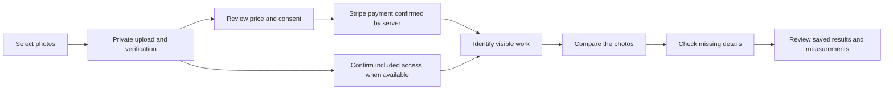

# Photo reading and review

In a project, select one to eight photos. RoughBid saves and verifies each image
in private storage, then shows a single price for the selected photos when a
purchase is required. Uploading does not start an AI request or charge a card.
Failed uploads can be retried without uploading the already saved images again.

The customer confirms the photos, price and data use before opening Stripe.
After the server verifies payment, processing starts automatically. The return
URL only restores the project and saved purchase; it never authorizes payment
or starts inference. Reopening the project retrieves the same purchase, reading
and saved results. A recovery button can enqueue that same paid reading when a
queue acknowledgement was lost.

An account with explicitly configured included access sees an included reading
confirmation instead of a fabricated charge. The account must still authorize
processing. A saved paid purchase always retains its payment and consent rules,
including when opened by an owner. Workspace AI consent is a separate, explicit
prerequisite, and is never inferred from an upload or account role.

The complete reading profile runs observation, cross-view reconciliation and
risk review. Progress is stored per image and per operation. The interface shows
which photos and stages were processed, which views are missing, and which
observations still require a dimensional reference or human decision. Older
observation-only records keep their original evidence and pending stages; they
are not relabeled as complete readings.

Processing can wait 24 hours or longer for company capacity. The saved run resumes
automatically when eligible, without a second purchase or replacement run. Its
progress is retained. An uncertain provider response is different from a capacity
wait: it requires reconciliation and is not automatically sent again. Cancellation
stops new work and preserves previous evidence and accounted exposure. An expired
processing authorization keeps saved results and clearly requires review before
new dispatch.

## Measurements and result boundaries

A completed AI pass is not approval of a construction quantity. Missing
dimensions and hidden surfaces remain pending; unknown quantities and an
unsourced estimate remain `null`, never zero. The result retains
`completeTakeoffVerified: false` until the required evidence and review exist.
Sourced composition and price joins remain separate from photo processing.

Visible counts require review. Instrument measurements must match a supplied
value, unit and localized reference for the same object. A known length does not
calibrate another plane. For supported planar measurements, the reviewer selects
four image points on a known rectangle, supplies its dimensions, reviews the
plane and perspective, and marks the measured polygon or polyline. The server
performs the deterministic transform and calculation. See
[planar photo measurements](photo-planar-calibration.md) for the evidence contract.
Matching an object across photos requires an explicit cross-view identity
decision, preventing overlapping views from being silently added twice.

Human review is tied to the authenticated reviewer and current saved review
revision. A repeated request key with identical intent returns its original
receipt; a changed intent or stale revision is rejected. The interface reloads
the saved review after a write or an uncertain acknowledgement.

## Saved data and verification

Private image intake validates bounded bytes, MIME, structural dimensions and a
content hash. The worker checks the same saved revision before dispatch. Signed
storage URLs, credentials and upstream response bodies are excluded from public
results and diagnostics. Metadata-only history and lazy per-image checkpoints
preserve access to earlier evidence while other images are still pending.

The complete paid contract binds all selected source revisions, stage routes,
bounded tariffs, one durable operation plan and explicit consent. Each operation
must fit the current company capacity and its saved provider allowance. Unknown
cost remains reserved exposure. A price is a fixed conservative allowance plus
the configured service margin, not a claim about observed provider spending.

Synthetic browser tests cover desktop/mobile selection, partial upload recovery,
paid and included consent, passive return, cancellation, changed contract hashes,
saved results and capacity waiting. Database and API tests cover tenant access,
payment binding, idempotency, checkpoint recovery and spending controls. These
tests make no real payment or external inference and do not establish production
activation, provider access, or the accuracy of a customer's reading.
