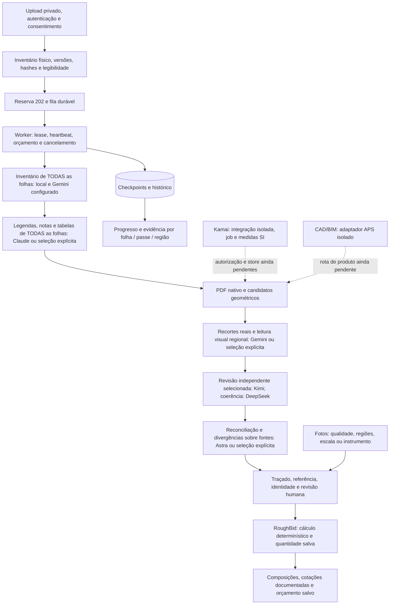

# RoughBid — entrega local revisável, 02/10/2026

O percurso está conectado no código e foi validado localmente com fontes sintéticas e serviços simulados. **Não houve inferência paga, upload real a fornecedores, cobrança, deploy, merge ou SQL de produção.** Esta entrega não comprova processamento de uma planta real pelos fornecedores nem precisão de medições automáticas.

Branch: `agent/roughbid-stage-engine-20261002`. Worktree: `task/roughbid-engine`. Base revisada: PR98 draft `7dfb9c8edba456a19dcd1b964c1d1837319ebc80`; main auditada `808e0b99a14477cb4a6525267e494c894e568766`. O checkout do usuário e seus arquivos concorrentes ficaram intactos. PR99/landing não integra esta entrega. O primeiro marco foi o commit `b8be810`; a série de patches e o manifesto final identificam os commits seguintes.

## O que já está ligado

- PDF: upload privado autenticado existente → manifesto físico e hashes → HTTP 202 → fila BullMQ → worker contínuo → checkpoints por folha, passe e região → progresso, cancelamento, retomada e evidência na UI.
- Medição: vetores nativos como candidatos, seleção de região e traçado do elemento sobre PDF com hash conferido → duas referências dimensionais independentes para comprimento/área → cálculo determinístico no servidor → revisão persistida, controle de concorrência e identidade física contra duplicação. Uma caixa detectada não comprova área de superfície. Contagem exige elemento visível identificado.
- Fotos: JPEG/PNG/WebP privados, qualidade/cobertura e evidências por região → job por imagem e checkpoints recuperáveis → quantidades sem referência permanecem indeterminadas → medida informada por instrumento ou contagem revisada pode ser aprovada e persistida. Revisões usam CAS e recibo idempotente. Calibração planar automática fica bloqueada enquanto faltar transformação determinística.
- Orçamento da obra: medidas aceitas do banco, catálogo inicial de 72 serviços, entradas dimensionais por componente, alocação documentada de equipamentos, importação de cotação, cálculo de embalagens e custos, snapshot imutável e recuperação pela UI. Preço/material/produtividade/frete/imposto desconhecidos ficam pendentes. O total completo permanece `null`; um subtotal conhecido não certifica cobertura da obra.
- Login/acesso: recuperação de callback expirado, timeout de sessão com retry, foco/teclado no modal, bloqueios por papel, tratamento de logout e troca de conta/workspace. Verificação de identidade, workspace, projeto, owner e RLS permanece no servidor; a fixture de navegador não prova login real em produção.
- Preço SaaS: simulador separado por documento e mensalidade, restrito ao proprietário, com custos técnicos/taxas/fontes revisados. Não cria checkout, assinatura, preço Stripe ou cobrança.

## Ordem de leitura e responsabilidades



O inventário e as legendas de todas as folhas precedem passes específicos. O worker recupera inventário anterior com sua página física para referências entre folhas. O contexto é limitado e sua insuficiência é registrada; não vira alegação de leitura completa. Os papéis acima são configurações iniciais para benchmark, não superioridade comprovada por marca. Não é obrigatório usar todos os fornecedores em cada arquivo.

O registro de capacidades inclui `gpt-6-astra`, `claude-opus-5-5`, `claude-fable-5-1`, `gemini-3.1-pro-preview`, `gemini-3.8-flash`, `kimi-k3`, `kimi-k2.6`, `deepseek-flash` e `deepseek-v4-pro`. Cada seleção exige identificador permitido, compatibilidade, acesso e tarifa atestados explicitamente. Ter uma chave na Vercel não comprova acesso ou billing. O perfil de maior esforço compatível não faz fallback silencioso para outra marca/modelo. DeepSeek Flash pode ler imagens; o perfil Pro registrado recebe somente texto/evidências. Kimi file-extract não substitui inspeção visual. Recortes locais mantêm dimensão medida, região e página, com até 1300 pixels por lado no caminho de visão reduzida.

Kamai e APS têm contratos/adaptadores e testes de transporte simulados; **não estão ligados automaticamente à geometria do produto**. Kamai precisa autorização de dados/OEM, preços/quota, estado terminal comprovado e store persistente do host. Seu status é string sem enum; um estado diferente de PENDING/RUNNING não comprova sucesso. O artefato é validado separadamente. `area_m2`, `perimeter_m` (inclui furos), `length_m` e `opening_width_m` são SI e não recebem escala de novo; null não é zero, objetos não são somados como cômodos, tags/folders não são quantidades. Texto percorre `text_offset` até `text_total`; conclusão multipágina não foi comprovada. APS é para CAD/BIM nativo; o adaptador rejeita PDF e não altera OAuth/Client Secret do app existente.

## Critério de término, recuperação e gasto

Não há teto total de cinco ou cinquenta minutos, atraso artificial ou retries pagos ilimitados. O término exige cobertura das folhas/categorias aplicáveis, evidências suficientes e verificação de conflitos; ambiguidades e regiões não visitadas são registradas. Mais tempo ou concordância de modelos não certificam medidas ou 100% de precisão.

Há timeout por tentativa, lease e heartbeat para detectar travamento. O cancelamento aborta o transporte local em andamento e impede novas etapas; o fornecedor remoto ainda pode ter processado a chamada. Custos/claims incertos ficam retidos para reconciliação e não são repetidos automaticamente. Checkpoints salvos são recuperáveis, inclusive regiões já concluídas. Grades visitadas não equivalem a cobertura semântica completa nem resolvem duplicatas em áreas sobrepostas.

Antes de qualquer chamada, o ledger reserva exposição máxima e aplica orçamento da empresa e da execução/provedor, modelos permitidos e quantidade finita de chamadas. Ausência de autorização ou orçamento esgotado interrompe o dispatch e mantém pendência. Os US$5 relatados por fornecedor não foram verificados e não são orçamento aprovado. O ledger registra telemetria e custo técnico; custo desconhecido não vira zero. As migrations não semeiam autorização ou saldo.

## Limites técnicos e lacunas exatas

| Área | Estado desta entrega |
| --- | --- |
| PDF | Até 50 MB e 200 folhas físicas por run no percurso atual; rejeição explícita, sem truncar. Conjuntos maiores ainda precisam particionamento persistente coordenado. |
| Regiões | Grade configurável 2×2 ou 3×3, sobreposição e checkpoints individuais. Limites de saída/observações geram bloqueio/releitura; não há subdivisão adaptativa ilimitada. |
| Rotação | A medição humana considera dimensões/rotação do PDF. Leitura regional automática de folha rotacionada bloqueia até transformação revisada. |
| Geometria | Traçado e revisão calibrados foram integrados. Não existe prova de segmentação automática completa de cômodos/elementos reais, nem de Kamai/APS ligados ao produto. |
| Contexto | Contexto entre folhas limitado a 24 KB; extrapolação gera pendência. Não se afirma completude de notas truncadas. |
| Fotos | Até 8 imagens, 20 MB cada/40 MB por lote e 64 MP. Validação estrutural de arquivo não é decodificação completa. Instrumento/contagem podem ser revisados; perspectiva/transformação automática e revisão independente completa permanecem pendentes. |
| Medidas/orçamento | Respostas paginadas/limitadas mostram `hasMore`. Apenas escopo selecionado e aceito é orçado. Quantidade ausente ou revisão antiga não é usada como quantidade verificada. |
| Preços | ZIP/loja/fuso e cotações reais ainda dependem do usuário. Não foi consultado preço de cliente em varejista, nem criado crawler/API comercial fictícia. |
| Fiscal | Helper/ledger anti-duplicação e suas pendências integram o snapshot; revisão fiscal persistida ainda não tem percurso próprio de entrada. Imposto desconhecido bloqueia custo total confirmado. |
| Comercial | Mensalidades/margem mensal e taxas reais não aprovadas permanecem pendentes. Simulador não vende ou cobra. |
| Online | Login/worker/LLMs/geometria de planta real não foram exercitados em produção. Não existe benchmark real nesta rodada. |

## Catálogo, cotações e impostos

Base pública `packages/domain/data/roughbid-catalog-base.json`, schema **1.1.0**, SHA256 `a5ca9590349f5bd32f2c49a17051a255fb18682d181f356b30c3cb7640cd02da`: 72 composições, 179 componentes materiais, 48 equipamentos, 12 categorias e 8 fontes oficiais. É catálogo inicial extensível; não universo completo. Preços, produtividade, perdas e cobertura desconhecidos não foram preenchidos. O AST permitido usa `input`, `constant` e `multiply` com validação dimensional; não há `eval` de fórmulas.

Compra: medida confirmada zero → pacotes zero; caso conhecido positivo → `ceil(max(minimum_order_packages, raw_packages)/order_increment_packages)*order_increment_packages`. Unknown continua pendente. Elementos distintos somam sua demanda antes de arredondar o grupo de compra. Mão de obra distingue crew-hour/worker-hour, setup/cleanup e fontes; equipamento exige uso/alocação, período, operador, transporte, retirada, combustível, mobilização, montagem e condições de acesso documentados quando aplicáveis.

Cotações persistidas vinculam fornecedor, SKU/modelo/especificação, quantidade comercial, embalagem, unidade, canal, ZIP/loja/fuso, disponibilidade, frete/imposto/condições, fonte e datas originais. Importar ou ler cache hoje não renova uma cotação antiga. Preço só habilita o componente quando corresponde ao produto, à demanda derivada, à loja e ao dia/validade. Não se rotula valor como ao vivo sem consulta bem-sucedida à fonte adequada. Estados incluem `awaiting_location`, `partner_access_required`, `quote_required`, `stale` e disponibilidade não verificada.

Lowe's exige comprovação de parceria/API/feed; acesso público de preços Home Depot não foi confirmado; Floor & Decor restringe coleta automatizada sem autorização. Loja escolhida automaticamente não define localização do usuário. Rotas oficiais de locação dependem de região/período/acesso. A alternativa implementada é importação de cotação documentada, sem contornar bloqueios.

Custos finais das linhas já incluem tributos não recuperáveis alocados. Só tributos comprovadamente não alocados entram em `unallocatedNonrecoverableTaxes`. Referência econômica única e decomposição comprovada evitam 100+10+10; preço com imposto incluído não recebe imposto presumido novamente. O snapshot preserva nodes fiscais pendentes e fontes da cotação, em vez de assumir imposto zero.

## Fonte exata das margens SaaS

Tabela versionada em `docs/business-finance-pricing.md:45`–`:49`, fórmula em `:39`, constante `packages/domain/src/project-charge.ts:2`:

| Categoria | Identificador | Margem por leitura |
| --- | --- | ---: |
| Avulso / sem associação | standard | 50% |
| Starter | starter | 40% |
| Pro | pro | 35% |
| Team | team | 30% |
| Enterprise | enterprise | 20% |

São margens sobre **receita**, após os custos técnicos e taxas de pagamento incluídos no cálculo; não markup sobre custo nem lucro líquido pós todos os impostos/despesas da empresa. Fórmula: `ceil((custo + taxa_fixa)/(1 - margem - taxa_percentual))`. Mensalidades Starter/Pro/Team são **TBD** nas linhas 116–118. A tabela não estabelece margem mensal; simulação mensal exige parâmetros de planejamento explicitamente documentados, sem ativação comercial. Fontes históricas de planos/add-ons não foram promovidas a preços aprovados.

## Provas locais

Suíte consolidada: **1177 testes aprovados, zero falhas, um teste real desativado** — 939 backend/domínio/SQL/MCP/Prisma e 238 web. Após a conferência do empacotamento, um teste novo de cobertura das rotas/JSON na Vercel também passou: **1178 testes distintos aprovados no total**. Os três testes anteriores dessa suite focada e as contagens do primeiro marco se sobrepõem; não foram somados novamente. TypeScript principal, web e worker estrito passaram. Build local do app passou em 6,94 s, com aviso de chunks grandes. Os flags de live test foram explicitamente falsos; teste real exige dois opt-ins independentes, além de chave/modelo.

SQL/PGlite executou as migrations reais em ambiente local: leases, gasto autorizado, custo incerto, tenant/RLS, CAS, quantidades recalculadas, cotações e snapshots imutáveis. Um percurso HTTP com SQL local usou medida revisada de 25 SF → demanda de 3 BOX × preço sintético 20 → subtotal conhecido 60 e total completo null. Isso é prova do produto local, não preço de varejo/obra real nem processamento externo.

Chrome headless em perfil separado, Vite de fixture com envDir isolado e bloqueio de destinos externos: **34 verificações passaram** (13 fluxo inicial, 13 geometria/SaaS, 8 orçamento), zero exceções e zero destinos externos. PDF sintético real foi renderizado; `reviewMeasurement` real calculou 64 SF por traçado e duas referências. API/identidade/armazenamento do browser e persistência do orçamento eram mocks/localStorage. Resultados salvos foram recuperados sem repetir POST; cancelamento/retomada, erros e viewer foram verificados. Não se afirma teste de auth/Supabase/worker real no navegador.

O build completo (`npm run build`) também passou em 4,97 s, com URL/chave pública fictícias de fixture e `VERCEL_ENV=development`, sem probes remotos. A configuração Vercel inclui o JSON versionado usado pelo cálculo; o guard de secrets do build cobre também os novos provedores. O `dist` de fixture não integra o pacote nem serve como deployment pronto.

Capturas sintéticas exportadas: `12-plan-reviewed-overlay.png`, `10-budget-saved-pending-quotes.png` e `04-photo-unscaled-evidence.png` (imagem com região e escala pendente). O QA também registrou referência humana em `05-photo-human-reference.png` e alternativa mobile `06-mobile-photo-flow.png`. Relatórios JSON, scripts reproduzíveis e [detalhes do QA](offline-browser-2026-10-02.md) acompanham a entrega.

## Ativação e rollback

O inventário remoto, datas e evidências verificáveis estão em [release-inventory-2026-10-02.md](release-inventory-2026-10-02.md). Ausência de ferramenta/acesso é registrada como não verificado. Não é autorização de implantação.

1. Revisar patches, diferenças contra main e histórico real do banco; criar backup e plano de execução em ambiente de teste autorizado. Não usar `db push` sobre a pasta inteira sem resolver versões históricas e dependências.
2. Conferir funções/tabelas/grants/RLS existentes. Preparar fundação V2 `20260910225937`, índices `20260910233003`, contrato multi-provider de gasto e dependências duráveis anteriores; depois aplicar, somente com aprovação própria, `20261002120000` → `130000` fotos → `140000` medições → `150000` regiões → `160000` orçamento por run → `170000` orçamento/cotações. Todos SQLs são revisáveis e foram testados localmente; não foram aplicados em produção.
3. Configurar Redis e worker contínuo com código compatível, storage privado, banco e configurações próprias; chaves da Vercel não são herdadas. Poppler local é necessário apenas para as etapas configuradas de imagem regional. Antes de intake, verificar `full_takeoff_stage_schema_ready`, heartbeat Full/foto e consumidor real das filas.
4. Manter `TAKEOFF_V2_ENABLED`, `TAKEOFF_V2_WORKER_ENABLED`, `TAKEOFF_V2_STAGE_PROVIDER_ENABLED` e `PHOTO_TAKEOFF_ENABLED`/`PHOTO_TAKEOFF_WORKER_ENABLED` desabilitados até revisão; manter flags Kamai/APS e aprovação de dados desligados. `ROUGH_BID_LIVE_TESTS_ENABLED=false` e `ROUGH_BID_LIVE_TEST_SPEND_APPROVED=false` permanecem falsos. Chaves isoladas não abrem chamadas.
5. Conferir auth redirects, grants de workspace/invite, consentimento e owner; usar usuário e arquivo sintéticos no ambiente de teste. Upload/medidas/cotações determinísticas podem ser verificados sem inferência externa, com processamento simulado claramente identificado.
6. Para qualquer futura inferência, primeiro obter autorização específica de dados e gasto por run/provedor, tarifa/exposição máxima e conta/modelo. Não foi autorizada nesta rodada. Ligar somente os passes necessários e medir cobertura/custo real. Kamai/APS exigem trabalho de integração e autorizações próprias antes de envio.

Uma opção concreta sem contratar serviço de worker é **este computador já autorizado**, com Node 24 e Poppler localizados nesta execução. `npm run worker` inicia o processo contínuo usando configuração manual do operador. Não foi iniciado: o schema remoto necessário está ausente e a conexão Redis não foi testada. O computador precisa permanecer ligado; restart recupera checkpoints/claims sem repetir chamada incerta. Docker não foi localizado no PATH desta conferência, portanto não é requisito para essa opção. Não se presume que o Redis existente seja gratuito ou saudável só porque seu nome está cadastrado.

Comandos de código/build, sem executar ativação externa:

```powershell
# Em um checkout de revisão baseado em main 808e0b99; não no checkout editado do dono.
git apply --check RoughBid-main-review.patch
# Após revisar/aplicar o patch, instalar dependências e compilar localmente:
npm ci --ignore-scripts
npm run build:app
# Somente após schema, Redis e configuração manual serem autorizados/conferidos:
npm run worker
```

O arquivo combinado é revisão contra main; os patches de commits são uma alternativa baseada em PR98. Não aplicar ambos. Não executar o worker contra filas reais antes dessa etapa operacional.

A necessidade de autorização externa neste handoff vem da instrução humana explícita da delegação inicial: **“Não mergear, publicar/deployar ou aplicar migrations de produção”**, reiterada nos pedidos posteriores, e da proibição de chamadas pagas/uploads a fornecedores. Não vem de AGENTS/SKILL ou de confirmação inventada: não foi encontrado AGENTS aplicável nem skill exigindo aprovação. Ajustes locais reversíveis e testes offline já autorizados foram executados sem pedir confirmação redundante. Alterar schema/serviço em produção afeta os dados, RLS/FKs, filas e ledger existentes; o pacote prepara essa decisão concreta, mas não a executa.

Rollback: desligar intake/flags, drenar ou cancelar jobs entre etapas, reconciliar claims/custos incertos e preservar checkpoints, revisões, recibos e cotações. Não apagar tabelas, liberar reserva incerta, repetir chamadas pagas ou executar down-migration destrutiva. Reverter código exige worker/API compatíveis e intake desabilitado durante a troca. Esta entrega não executa nenhuma dessas ações externas.

## Configuração por nomes, sem valores

| Destino | Nomes/contratos |
| --- | --- |
| API/storage/auth | nomes existentes Supabase, storage privado e workspace/owner; redirects/grants conforme `docs/integrations/auth-access.md` |
| Worker/fila | `REDIS_URL`, `TAKEOFF_V2_ENABLED`, `TAKEOFF_V2_WORKER_ENABLED`, `TAKEOFF_V2_SCHEMA_VERSION`, `TAKEOFF_V2_STAGE_PROVIDER_ENABLED` |
| LLMs | `OPENAI_API_KEY`, `OPENAI_MODEL`, `ANTHROPIC_API_KEY`, `CLAUDE_PLAN_MODEL`, `TAKEOFF_V2_CLAUDE_MODEL`, `GEMINI_API_KEY`, `GEMINI_MODEL`, `KIMI_API_KEY`, `KIMI_MODEL`, `KIMI_VISION_MODEL`, `DEEPSEEK_API_KEY`, `DEEPSEEK_MODEL`, `DEEPSEEK_VISION_MODEL`, `DEEPSEEK_TEXT_MODEL`; modelos por passe usam `_MODEL` explícito |
| Roteamento | `TAKEOFF_V2_STAGE_<PASS>_ENABLED`, `_PROVIDER`, `_MODEL`; `TAKEOFF_V2_MODEL_ATTESTATIONS_JSON`, `TAKEOFF_V2_RUN_SPEND_LIMITS_JSON`; Kimi/DeepSeek exigem também `KIMI_PRIVATE_PLAN_DATA_APPROVED`/`DEEPSEEK_PRIVATE_PLAN_DATA_APPROVED` |
| Regiões | `TAKEOFF_V2_REGIONAL_REVIEW_ENABLED`, `TAKEOFF_V2_REGION_GRID`, `TAKEOFF_V2_POPPLER_BINARY`, `TAKEOFF_V2_REGION_RENDER_TIMEOUT_MS`, `TAKEOFF_V2_REGION_RENDER_MAX_EDGE_PX` |
| Fotos | flags, perfil exato, attestations e `PHOTO_TAKEOFF_APPROVED_RUN_BUDGET_USD`/`PHOTO_TAKEOFF_RUN_BUDGET_APPROVAL_REF` descritos em `docs/photo-takeoff-review.md`; nenhum orçamento padrão |
| Kamai/APS | `KAMAI_API_KEY`, `APS_CLIENT_ID`, `APS_CLIENT_SECRET`; flags de integração/dados/OEM/status verificado descritos no documento do motor; default desligado |
| Testes pagos | `ROUGH_BID_LIVE_TESTS_ENABLED`, `ROUGH_BID_LIVE_TEST_SPEND_APPROVED`; ambos permanecem false |

Os nomes acima não afirmam cadastro remoto ou validade; veja o inventário para estado observado. Nenhum `.env` foi lido, copiado ou editado. `.env.example` rastreado não é protegido por ignore; deve conter somente placeholders e não integra patches/exportação desta rodada.

Fontes oficiais: [OpenAI Astra](https://developers.openai.com/api/docs/models/gpt-6-astra), [PDF OpenAI](https://developers.openai.com/api/docs/guides/file-inputs), [Claude structured outputs](https://platform.claude.com/docs/en/build-with-claude/structured-outputs), [Gemini PDF](https://ai.google.dev/gemini-api/docs/document-processing), [Kimi visão](https://platform.kimi.ai/docs/guide/use-kimi-vision-model), [DeepSeek visão](https://api-docs.deepseek.com/guides/vision/), [Kamai OpenAPI](https://api.kamai.io/openapi.json), [Kamai quickstart](https://kamai.io/developers/quickstart.md), [APS traduções](https://aps.autodesk.com/en/docs/model-derivative/v2/developers_guide/supported-translations/supported-translation/), [Vercel Functions](https://vercel.com/docs/functions/limitations), [Lowe's catálogo](https://developer.lowes.com/portal/business-components/Product%20Catalog/), [Floor & Decor termos](https://www.flooranddecor.com/policies/terms.html). Contratos públicos não comprovam acesso, licença, preço, conta ou desempenho desta implantação.
