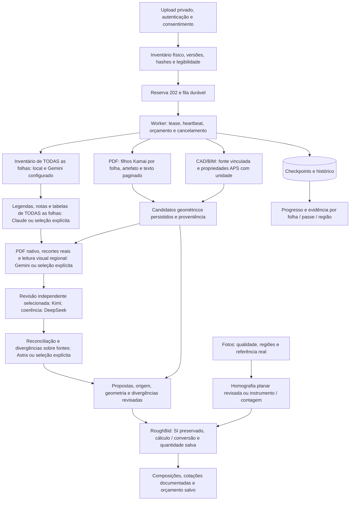

# RoughBid — entrega local revisável, 02–03/10/2026

O percurso **upload de PDF → job durável → extração geométrica por adaptador → candidatos com evidência → revisão → quantitativo → orçamento salvo e visível** está conectado no código de produção e foi exercitado localmente com fontes sintéticas e fornecedores simulados. Fotos também têm cálculo planar determinístico integrado à revisão e ao orçamento. **Não houve inferência paga, upload real a fornecedores, cobrança, deploy, merge ou SQL de produção.** As provas offline não comprovam processamento de uma planta real por Kamai/APS/LLMs, precisão de medidas físicas ou prontidão da infraestrutura de produção.

Branch: `agent/roughbid-stage-engine-20261002`. Worktree: `task/roughbid-engine`. Base revisada: PR98 draft `7dfb9c8edba456a19dcd1b964c1d1837319ebc80`; main auditada `808e0b99a14477cb4a6525267e494c894e568766`. O checkout do usuário e seus arquivos concorrentes ficaram intactos. PR99/landing não integra esta entrega. Os checkpoints `b8be810` e `6e5a89a` precedem a extensão geométrica; a série de patches e o manifesto final identificam o commit final e seus arquivos.

## O que já está ligado

- PDF: upload privado autenticado → manifesto físico e hashes → HTTP 202 → fila BullMQ → worker contínuo. A preparação no worker reserva um filho geométrico por folha física quando Kamai está explicitamente autorizado; a requisição HTTP não envia a planta nem executa esse fan-out. Passes semânticos, regiões e artefatos geométricos têm checkpoints, progresso, cancelamento e retomada.
- Geometria automática: rotas de projeto, stores SQL, consumidor BullMQ e adaptadores Kamai/APS alimentam candidatos persistidos com fonte, versão, folha, elemento, unidade, geometria e revisão. O candidato válido chega à UI com medida fornecida pelo adaptador; a revisão normal confirma origem/geometria/identidade/duplicatas, sem exigir digitar novamente a quantidade. Só candidatos aceitos do banco entram no orçamento. Uma revisão nova da fonte invalida os candidatos antigos para novos cálculos; snapshots anteriores preservam seu histórico.
- Medição alternativa: traçado sobre PDF com hash conferido e duas referências dimensionais independentes permite corrigir/complementar evidência insuficiente. IDs são gerados quando possível; diagnóstico técnico fica em seção avançada. Uma caixa detectada não comprova área de superfície. Contagem exige elemento visível identificado.
- CAD/BIM: rota própria APS, com objeto e versão vinculados ao projeto por uma configuração revisada do operador. Propriedades geométricas com unidade explícita podem gerar candidatos; URN, metadata, dbId ou bounding box isolados não viram medida física. Não há envio de PDF a APS nem criação/alteração de app OAuth.
- Fotos: JPEG/PNG/WebP privados → qualidade/cobertura e evidências → job por imagem → revisão persistida. Quatro pontos correspondentes a um retângulo real e dimensões fornecidas permitem homografia no servidor, transformação dos vértices e área/comprimento da região no mesmo plano. Quantidade planar enviada pelo cliente é recusada. Sem escala/coplanaridade suficiente, a quantidade permanece pendente; instrumento/contagem revisada continuam disponíveis. CAS e recibos idempotentes preservam correções e retomada.
- Orçamento da obra: medidas aceitas do banco, catálogo inicial de 72 serviços, entradas dimensionais por componente, alocação documentada de equipamentos, importação de cotação, cálculo de embalagens e custos, snapshot imutável e recuperação pela UI. Preço/material/produtividade/frete/imposto desconhecidos ficam pendentes. O total completo permanece `null`; um subtotal conhecido não certifica cobertura da obra.
- Login/acesso: recuperação de callback expirado, timeout de sessão com retry, foco/teclado no modal, bloqueios por papel, tratamento de logout e troca de conta/workspace. Verificação de identidade, workspace, projeto, owner e RLS permanece no servidor; a fixture de navegador não prova login real em produção.
- Preço SaaS: simulador separado por documento e mensalidade, restrito ao proprietário, com custos técnicos/taxas/fontes revisados. Não cria checkout, assinatura, preço Stripe ou cobrança.

## Ordem de leitura e responsabilidades



O inventário e as legendas de todas as folhas precedem os passes semânticos específicos. A reserva dos filhos geométricos ocorre na preparação durável e pode avançar em paralelo com esse inventário; a implementação não impõe que todo artefato Kamai termine antes da leitura semântica. A visão por folha carrega candidatos da fonte/hash/página correspondentes e registra o que falta. O worker recupera inventário anterior com sua página física para referências entre folhas. O contexto é limitado e sua insuficiência não vira alegação de leitura completa. Os papéis de Gemini, Claude, Kimi, DeepSeek e Astra são configurações iniciais sujeitas a benchmark, sem superioridade comprovada por marca; não é obrigatório usar todos em cada arquivo.

O registro de capacidades inclui `gpt-6-astra`, `claude-opus-5-5`, `claude-fable-5-1`, `gemini-3.1-pro-preview`, `gemini-3.8-flash`, `kimi-k3`, `kimi-k2.6`, `deepseek-flash` e `deepseek-v4-pro`. Cada seleção exige identificador permitido, compatibilidade, acesso e tarifa atestados explicitamente. Ter uma chave na Vercel não comprova acesso ou billing. O perfil de maior esforço compatível não faz fallback silencioso para outra marca/modelo. DeepSeek Flash pode ler imagens; o perfil Pro registrado recebe somente texto/evidências. Kimi file-extract não substitui inspeção visual. Recortes locais mantêm dimensão medida, região e página, com até 1300 pixels por lado no caminho de visão reduzida.

Kamai/APS estão ligados por `/api/projects/:id/geometry/...`, `geometry_provider_jobs`, `geometry_provider_candidates` e `GeometryProcessor`; ativação externa permanece fechada. Kamai ainda exige autorização de dados/OEM, preço/quota e atestação do estado terminal real: seu status público é string sem enum, e sair de PENDING/RUNNING não comprova sucesso. O worker verifica o hash do PDF original, isola uma folha física por upload e conserva também o hash do arquivo enviado. Artefato, revisão e paginação de palavras são validados; candidatos só são liberados após `text_offset == text_total`. Esse particionamento evita depender de conclusão multipágina do fornecedor, que continua sem prova externa.

`area_m2`, `perimeter_m` (inclui furos), `length_m` e `opening_width_m` já são SI e não recebem escala de novo. GeoJSON é planar local, sem cálculo geodésico; null não é zero. Área de objetos não é agregada como área de cômodos; tags iguais não fundem portas distintas e folders não geram contagem. Identidade inclui fonte/hash/folha/versão/elemento; duplicatas ou geometria inválida permanecem bloqueadas. A UI mostra o frame próprio do fornecedor com esse aviso: **não está alinhado ao PDF**. Não se fabrica um overlay com coordenadas incompatíveis.

APS processa CAD/BIM nativo e exige `GEOMETRY_APS_SOURCE_BINDINGS_JSON` revisado com projeto, objeto, versão, hash e referência documental. Esse vínculo é atestação operacional, não prova de hash do objeto remoto obtida nesta rodada. Propriedades tipadas convertem mm/ft e unidades de área para SI; ausência de unidade ou medida adequada deixa candidato pendente. dbId é interpretado junto da versão/view/property da tradução, sem presumir estabilidade entre SVF1/SVF2. Propriedades nativas não substituem prova de geometria de superfícies irregulares nem cálculo por bounding box.

## Critério de término, recuperação e gasto

Não há teto total de cinco ou cinquenta minutos, atraso artificial ou retries pagos ilimitados. O término exige cobertura das folhas/categorias aplicáveis, evidências suficientes e verificação de conflitos; ambiguidades e regiões não visitadas são registradas. Mais tempo ou concordância de modelos não certificam medidas ou 100% de precisão.

Há timeout por tentativa, lease e heartbeat para detectar travamento. O worker geométrico reconcilia o intervalo entre persistência e confirmação da fila no startup e a cada 30 segundos, com no máximo 50 registros por consulta e IDs de recovery derivados do registro. Polling é um tick persistido seguido de novo job atrasado, sem prazo total artificial. Upload/submissão com resultado incerto não é repetido automaticamente. O cancelamento SQL do pai Full cancela atomicamente seus filhos ativos, inclusive quando o perfil de fornecedor está desligado; heartbeat/lease abortam o transporte local. O fornecedor remoto ainda pode ter processado uma chamada já enviada. Custos/claims incertos ficam retidos para reconciliação. Grades visitadas e artefatos disponíveis não certificam cobertura semântica nem resolvem todas as duplicatas.

Antes de qualquer chamada, o ledger reserva exposição máxima e aplica orçamento da empresa e da execução/provedor, modelos permitidos e quantidade finita de chamadas. A geometria agrega exposição entre filhos do mesmo documento/hash/provedor: dividir 200 folhas não multiplica 200 vezes o orçamento aprovado. Polling e OAuth também passam pela reserva conservadora de exposição. Ausência de autorização, limite de chamadas ou orçamento esgotado interrompe dispatch e mantém pendência. Os US$5 relatados por fornecedor não foram verificados e não são orçamento aprovado. Custo desconhecido não vira zero; as migrations não semeiam autorização ou saldo.

## Limites técnicos e lacunas exatas

| Área | Estado desta entrega |
| --- | --- |
| PDF | Até 50 MB e 200 folhas físicas por run no percurso atual; rejeição explícita, sem truncar. Conjuntos maiores ainda precisam particionamento persistente coordenado. |
| Regiões | Grade configurável 2×2 ou 3×3, sobreposição e checkpoints individuais. Limites de saída/observações geram bloqueio/releitura; não há subdivisão adaptativa ilimitada. |
| Rotação | A medição humana considera dimensões/rotação do PDF. Leitura regional automática de folha rotacionada bloqueia até transformação revisada. |
| Geometria | Ponte automática, candidatos persistidos, revisão e orçamento integrados com fixtures no código de produção. Não há benchmark de segmentação/medidas reais, certificação de área por consenso ou alinhamento Kamai→PDF. Limites de artefatos/candidatos geram bloqueio ou `hasMore`, sem completude silenciosa. |
| Contexto | Contexto entre folhas limitado a 24 KB; extrapolação gera pendência. Não se afirma completude de notas truncadas. |
| Fotos | Até 8 imagens, 20 MB cada/40 MB por lote e 64 MP. Homografia determinística de região simples dentro de um quadrilátero calibrado está integrada; exige dimensões reais, correspondência, revisão de lente e mesmo plano. Não corrige lente, não prova coplanaridade, não infere profundidade/volumes/partes ocultas e não suporta furos/extrapolação. Incerteza física não foi quantificada; revisão independente completa permanece pendente. |
| Medidas/orçamento | Respostas paginadas/limitadas mostram `hasMore`. Apenas escopo selecionado e aceito é orçado. Quantidade ausente ou revisão antiga não é usada como quantidade verificada. |
| Preços | ZIP/loja/fuso e cotações reais ainda dependem do usuário. Não foi consultado preço de cliente em varejista, nem criado crawler/API comercial fictícia. |
| Fiscal | Helper/ledger anti-duplicação e suas pendências integram o snapshot; revisão fiscal persistida ainda não tem percurso próprio de entrada. Imposto desconhecido bloqueia custo total confirmado. |
| Comercial | Mensalidades/margem mensal e taxas reais não aprovadas permanecem pendentes. Simulador não vende ou cobra. |
| Online | Login/worker/LLMs/geometria de planta real não foram exercitados em produção. Não existe benchmark real nesta rodada. |

## Catálogo, cotações e impostos

Base pública `packages/domain/data/roughbid-catalog-base.json`, schema **1.1.0**, SHA256 `a5ca9590349f5bd32f2c49a17051a255fb18682d181f356b30c3cb7640cd02da`: 72 composições, 179 componentes materiais, 48 equipamentos, 12 categorias e 8 fontes oficiais. É catálogo inicial extensível; não universo completo. Preços, produtividade, perdas e cobertura desconhecidos não foram preenchidos. O AST permitido usa `input`, `constant` e `multiply` com validação dimensional; não há `eval` de fórmulas.

Compra: medida confirmada zero → pacotes zero; caso conhecido positivo → `ceil(max(minimum_order_packages, raw_packages)/order_increment_packages)*order_increment_packages`. Unknown continua pendente. Elementos distintos somam sua demanda antes de arredondar o grupo de compra. Mão de obra distingue crew-hour/worker-hour, setup/cleanup e fontes; equipamento exige uso/alocação, período, operador, transporte, retirada, combustível, mobilização, montagem e condições de acesso documentados quando aplicáveis.

Cotações persistidas vinculam fornecedor, SKU/modelo/especificação, quantidade comercial, embalagem, unidade, canal, ZIP/loja/fuso, disponibilidade, frete/imposto/condições, fonte e datas originais. Importar ou ler cache hoje não renova uma cotação antiga. Preço só habilita o componente quando corresponde ao produto, à demanda derivada, à loja e ao dia/validade. Não se rotula valor como ao vivo sem consulta bem-sucedida à fonte adequada. Estados incluem `awaiting_location`, `partner_access_required`, `quote_required`, `stale` e disponibilidade não verificada.

Lowe's exige comprovação de parceria/API/feed; acesso público de preços Home Depot não foi confirmado; Floor & Decor restringe coleta automatizada sem autorização. Loja escolhida automaticamente não define localização do usuário. Rotas oficiais de locação dependem de região/período/acesso. A alternativa implementada é importação de cotação documentada, sem contornar bloqueios.

Custos finais das linhas já incluem tributos não recuperáveis alocados. Só tributos comprovadamente não alocados entram em `unallocatedNonrecoverableTaxes`. Referência econômica única e decomposição comprovada evitam 100+10+10; preço com imposto incluído não recebe imposto presumido novamente. O snapshot preserva nodes fiscais pendentes e fontes da cotação, em vez de assumir imposto zero.

## Fonte exata das margens SaaS

Tabela versionada em `docs/business-finance-pricing.md:45`–`:49`, fórmula em `:39`, constante `packages/domain/src/project-charge.ts:2`:

| Categoria | Identificador | Margem por leitura |
| --- | --- | ---: |
| Avulso / sem associação | standard | 50% |
| Starter | starter | 40% |
| Pro | pro | 35% |
| Team | team | 30% |
| Enterprise | enterprise | 20% |

São margens sobre **receita**, após os custos técnicos e taxas de pagamento incluídos no cálculo; não markup sobre custo nem lucro líquido pós todos os impostos/despesas da empresa. Fórmula: `ceil((custo + taxa_fixa)/(1 - margem - taxa_percentual))`. Mensalidades Starter/Pro/Team são **TBD** nas linhas 116–118. A tabela não estabelece margem mensal; simulação mensal exige parâmetros de planejamento explicitamente documentados, sem ativação comercial. Fontes históricas de planos/add-ons não foram promovidas a preços aprovados.

O catálogo/regras standalone 1.1.0 foram escritos antes da localização dessa tabela e conservam `reported_existing_targets_unverified`/`may_drive_live_pricing:false`. Esse registro descreve a evidência disponível quando os arquivos foram produzidos; a fonte versionada por leitura está agora confirmada acima e usada pelo simulador do domínio. Não foi alterado o JSON nem seu hash. Mensalidades/margem mensal continuam pendentes e essa atualização documental não habilita live pricing.

## Provas locais

Na conferência final da extensão, **63/63 testes direcionados backend/SQL e 83/83 frontend passaram**, zero falhas. As suites incluem regressões e se sobrepõem ao checkpoint abaixo; não foram somadas como casos novos.

No checkpoint `6e5a89a`, **1178 testes distintos passaram**, zero falhas e um teste real desativado: 939 backend/domínio/SQL/MCP/Prisma, 238 web e um teste novo de empacotamento. TypeScript principal, web e worker estrito e os builds locais também passaram naquele checkpoint. A extensão foi validada por suites direcionadas descritas abaixo e no manifesto final; reruns/suites parcialmente sobrepostas não foram somadas como um novo total consolidado. Os flags de live test permaneceram falsos; chave presente nunca é opt-in e o teste real exige duas autorizações explícitas independentes.

SQL/PGlite executou migrations reais em banco local: leases, gasto autorizado, custo incerto, tenant/RLS, CAS, quantidades recalculadas, cotações e snapshots imutáveis. Na extensão, **4/4 testes integrados HTTP/PGlite** exercitaram os handlers e `GeometryProcessor` reais com transporte Kamai simulado: PDF sintético → reserva/job → upload/polling mock → **96 m² conservados mesmo com escala 1:50** → candidato persistido → revisão HTTP ignora quantidade arbitrária do navegador → **1033,3354 SF**, uma única conversão → **11 BOX × preço sintético 20 = subtotal conhecido 220**, total completo `null` → snapshot SQL com pai geométrico real → GET/reload. Também passaram os gates de perfil/fila/gasto/workspace/viewer, replay após confirmação perdida e invalidação por nova revisão de PDF, preservando o snapshot histórico. Isso comprova a ponte local no código de produção, não um preço de varejo nem uma chamada Kamai real.

Fotos tiveram **18 testes direcionados aprovados**: 17 fixtures matemáticas/regressões e um percurso HTTP/PostgreSQL real. O servidor calculou 120 SF na referência integral e 60 SF após correção de região; CAS/replay preservaram a revisão nova, e plano desconhecido voltou a pendência. As fixtures cobrem perspectiva projetiva com sub-região de 2 m², conversões, correspondências reversas válidas, degeneração, horizonte/extrapolação, fonte antiga e escala/plano insuficientes. Essas tolerâncias numéricas não são precisão física comprovada. [Contrato e limitações da homografia](../photo-planar-calibration.md).

Chrome headless em perfil separado, Vite com `envDir` isolado e bloqueio de destinos externos registrou **51 verificações distintas**: 34 anteriores e 17 novas (8 geometria automática; 9 foto planar), zero exceções e zero destinos externos observados. O percurso novo usou `PlansPage` real: upload de PDF sintético → job mock salvo → proposta SI de 5,94579456 m² → confirmação sem digitar medida → 64 SF no orçamento salvo/recuperado, com preço/total pendentes. A superfície de outro objeto foi rejeitada sem aumentar a área do cômodo. Na foto, UI e cálculo Node real passaram de 120 para 60 SF, recuperaram a prova e exibiram orçamento pendente, inclusive em 390 px sem overflow. Identidade/API/storage/jobs/persistência de browser são mocks/localStorage; SQL e worker são provas separadas. Cancelamento/retomada, erro e viewer estão cobertos na rodada anterior; não se afirma login/Supabase/Redis ou fornecedor real no navegador.

Após a extensão, TypeScript da API, web e worker estrito passaram; o build completo passou em 4,98 s, com URL/chave pública fictícias de fixture e `VERCEL_ENV=development`, sem probes remotos. A configuração Vercel inclui o JSON versionado usado pelo cálculo; o guard de secrets do build cobre também os novos provedores. O `dist` de fixture não integra o pacote nem serve como deployment pronto. As 83 verificações frontend direcionadas também passaram; há sobreposição com as suites do checkpoint e elas não foram acrescentadas a um total consolidado.

Capturas finais sintéticas, rotuladas OFFLINE: `20-automatic-geometry-confirmed.png`, `21-automatic-geometry-budget.png`, `22-photo-planar-calibration.png`; a alternativa mobile é `23-photo-planar-mobile-result.png`. O overlay manual anterior permanece documentado, mas o preview novo usa o frame do fornecedor e declara que não está alinhado ao PDF. Relatórios JSON, scripts e os [detalhes do QA inicial](offline-browser-2026-10-02.md) e [da extensão automática](offline-browser-automatic-2026-10-03.md) acompanham a entrega. Nomes externos e hashes finais constam do manifesto exportado.

## Ativação e rollback

O inventário remoto, datas e evidências verificáveis estão em [release-inventory-2026-10-02.md](release-inventory-2026-10-02.md). Ausência de ferramenta/acesso é registrada como não verificado. Não é autorização de implantação.

1. Revisar patches, diferenças contra main e histórico real do banco; criar backup e plano de execução em ambiente de teste autorizado. Não usar `db push` sobre a pasta inteira sem resolver versões históricas e dependências.
2. Conferir funções/tabelas/grants/RLS e o histórico real. A ordem de **16 SQLs** está no inventário: dependências duráveis, fundação V2, índices, ledger multi-provider e scan; depois `20261002120000` → `130000` fotos → `140000` medições → `150000` regiões → `160000` orçamento por run → `170000` orçamento/cotações → `180000` jobs/candidatos geométricos → `190000` pai geométrico do snapshot. Os novos SQL18/19 são preparados e testados localmente, sem DDL remoto; seus objetos/RPCs/coluna pesquisados estavam ausentes na consulta complementar de metadados de 03/10, 01:06–01:07 UTC. Não reaplicar a base comercial já existente.
3. Configurar manualmente Redis e worker contínuo com código compatível, storage privado e banco; chaves da Vercel não são herdadas. Antes de intake, verificar `full_takeoff_stage_schema_ready`, heartbeat Full/foto/geometria e consumidor real das respectivas filas. A capacidade geométrica exige heartbeat do perfil e `getWorkers()` do BullMQ; nome `REDIS_URL` presente não basta. Poppler é necessário somente para as etapas configuradas de imagem regional.
4. Manter `TAKEOFF_V2_ENABLED`, `TAKEOFF_V2_WORKER_ENABLED`, `TAKEOFF_V2_STAGE_PROVIDER_ENABLED`, `PHOTO_TAKEOFF_ENABLED`/`PHOTO_TAKEOFF_WORKER_ENABLED`, `GEOMETRY_PROVIDER_ENABLED`, `GEOMETRY_PROVIDER_SPEND_APPROVED` e flags Kamai/APS/dados desligados. `ROUGH_BID_LIVE_TESTS_ENABLED=false` e `ROUGH_BID_LIVE_TEST_SPEND_APPROVED=false` permanecem falsos. Chaves isoladas não abrem chamadas e a criação das tabelas não aprova gasto.
5. Conferir auth redirects, grants de workspace/invite, consentimento e owner; usar usuário e arquivo sintéticos no ambiente de teste. Upload/medidas/cotações determinísticas podem ser verificados sem inferência externa, com processamento simulado claramente identificado.
6. Para qualquer futura inferência, primeiro obter autorização específica de dados e gasto por documento/provedor, tarifa/exposição máxima, limites de chamadas e conta/modelo. Não foi autorizada nesta rodada. Ligar somente os passes necessários e medir cobertura/custo real. A ponte de código Kamai/APS está preparada; termos, acesso, estado terminal Kamai atestado e vínculo de fonte APS continuam requisitos externos antes de transmissão.

Uma opção concreta sem contratar serviço de worker é **este computador já autorizado**, com Node 24 e Poppler localizados nesta execução. `npm run worker` inicia o processo contínuo usando configuração manual do operador. Não foi iniciado: o schema remoto necessário está ausente e a conexão Redis não foi testada. O computador precisa permanecer ligado; restart recupera checkpoints/claims sem repetir chamada incerta. Docker não foi localizado no PATH desta conferência, portanto não é requisito para essa opção. Não se presume que o Redis existente seja gratuito ou saudável só porque seu nome está cadastrado.

Comandos de código/build, sem executar ativação externa:

```powershell
# Em um checkout de revisão baseado em main 808e0b99; não no checkout editado do dono.
git apply --check RoughBid-main-review.patch
# Após revisar/aplicar o patch, instalar dependências e compilar localmente:
npm ci --ignore-scripts
npm run build:app
# Somente após schema, Redis e configuração manual serem autorizados/conferidos:
npm run worker
```

O arquivo combinado é revisão contra main; os patches de commits são uma alternativa baseada em PR98. Não aplicar ambos. Não executar o worker contra filas reais antes dessa etapa operacional.

O limite operacional de ativação nesta rodada vem do handoff recebido, na delegação inicial: **“Não mergear, publicar/deployar ou aplicar migrations de produção”**, reiterada nos pedidos posteriores, e da proibição de chamadas pagas/uploads a fornecedores. Essa formulação está no handoff; não foi identificada como fala humana direta no material recebido. Não vem de AGENTS/SKILL ou de confirmação inventada: não foi encontrado AGENTS aplicável nem skill exigindo aprovação. Ajustes locais reversíveis e testes offline já autorizados foram executados sem pedir confirmação redundante. Alterar schema/serviço em produção afeta os dados, RLS/FKs, filas e ledger existentes; o pacote prepara essa decisão concreta, mas não a executa.

Rollback: desligar intake/flags, drenar ou cancelar jobs entre etapas, reconciliar claims/custos incertos e preservar checkpoints, revisões, recibos e cotações. Não apagar tabelas, liberar reserva incerta, repetir chamadas pagas ou executar down-migration destrutiva. Reverter código exige worker/API compatíveis e intake desabilitado durante a troca. Esta entrega não executa nenhuma dessas ações externas.

## Configuração por nomes, sem valores

| Destino | Nomes/contratos |
| --- | --- |
| API/storage/auth | nomes existentes Supabase, storage privado e workspace/owner; redirects/grants conforme `docs/integrations/auth-access.md` |
| Worker/fila | `REDIS_URL`, `TAKEOFF_V2_ENABLED`, `TAKEOFF_V2_WORKER_ENABLED`, `TAKEOFF_V2_SCHEMA_VERSION`, `TAKEOFF_V2_STAGE_PROVIDER_ENABLED` |
| LLMs | `OPENAI_API_KEY`, `OPENAI_MODEL`, `ANTHROPIC_API_KEY`, `CLAUDE_PLAN_MODEL`, `TAKEOFF_V2_CLAUDE_MODEL`, `GEMINI_API_KEY`, `GEMINI_MODEL`, `KIMI_API_KEY`, `KIMI_MODEL`, `KIMI_VISION_MODEL`, `DEEPSEEK_API_KEY`, `DEEPSEEK_MODEL`, `DEEPSEEK_VISION_MODEL`, `DEEPSEEK_TEXT_MODEL`; modelos por passe usam `_MODEL` explícito |
| Roteamento | `TAKEOFF_V2_STAGE_<PASS>_ENABLED`, `_PROVIDER`, `_MODEL`; `TAKEOFF_V2_MODEL_ATTESTATIONS_JSON`, `TAKEOFF_V2_RUN_SPEND_LIMITS_JSON`; Kimi/DeepSeek exigem também `KIMI_PRIVATE_PLAN_DATA_APPROVED`/`DEEPSEEK_PRIVATE_PLAN_DATA_APPROVED` |
| Regiões | `TAKEOFF_V2_REGIONAL_REVIEW_ENABLED`, `TAKEOFF_V2_REGION_GRID`, `TAKEOFF_V2_POPPLER_BINARY`, `TAKEOFF_V2_REGION_RENDER_TIMEOUT_MS`, `TAKEOFF_V2_REGION_RENDER_MAX_EDGE_PX` |
| Fotos | flags, perfil exato, attestations e `PHOTO_TAKEOFF_APPROVED_RUN_BUDGET_USD`/`PHOTO_TAKEOFF_RUN_BUDGET_APPROVAL_REF` descritos em `docs/photo-takeoff-review.md`; nenhum orçamento padrão |
| Geometria durável | `GEOMETRY_PROVIDER_ENABLED`, `GEOMETRY_PROVIDER_SPEND_APPROVED`, `GEOMETRY_PROVIDER_RUN_BUDGET_USD`, `GEOMETRY_PROVIDER_MAXIMUM_CALL_COST_USD`, `GEOMETRY_PROVIDER_MAXIMUM_CALLS`, `GEOMETRY_PROVIDER_APPROVAL_REF`; não há orçamento inferido do saldo |
| Kamai | `KAMAI_API_KEY`, `TAKEOFF_V2_KAMAI_ENABLED`, `TAKEOFF_V2_KAMAI_INTEGRATION_APPROVED`, `TAKEOFF_V2_KAMAI_DATA_OEM_AUTHORIZED`, `TAKEOFF_V2_KAMAI_SUCCESS_STATUS`, `TAKEOFF_V2_KAMAI_SUCCESS_STATUS_VERIFIED`; default desligado e estado terminal sem valor presumido |
| APS | `APS_CLIENT_ID`, `APS_CLIENT_SECRET`, `TAKEOFF_V2_APS_ENABLED`, `TAKEOFF_V2_APS_INTEGRATION_APPROVED`, `TAKEOFF_V2_APS_DATA_AUTHORIZED`, `GEOMETRY_APS_SOURCE_BINDINGS_JSON`; vínculo revisado de projeto/objeto/versão/hash/prova, sem troca de credenciais |
| Testes pagos | `ROUGH_BID_LIVE_TESTS_ENABLED`, `ROUGH_BID_LIVE_TEST_SPEND_APPROVED`; ambos permanecem false |

Os nomes acima não afirmam cadastro remoto ou validade; veja o inventário para estado observado. Nenhum `.env` foi lido, copiado ou editado. `.env.example` rastreado não é protegido por ignore; deve conter somente placeholders e não integra patches/exportação desta rodada.

Fontes oficiais: [OpenAI Astra](https://developers.openai.com/api/docs/models/gpt-6-astra), [PDF OpenAI](https://developers.openai.com/api/docs/guides/file-inputs), [Claude structured outputs](https://platform.claude.com/docs/en/build-with-claude/structured-outputs), [Gemini PDF](https://ai.google.dev/gemini-api/docs/document-processing), [Kimi visão](https://platform.kimi.ai/docs/guide/use-kimi-vision-model), [DeepSeek visão](https://api-docs.deepseek.com/guides/vision/), [Kamai OpenAPI](https://api.kamai.io/openapi.json), [Kamai quickstart](https://kamai.io/developers/quickstart.md), [APS traduções](https://aps.autodesk.com/en/docs/model-derivative/v2/developers_guide/supported-translations/supported-translation/), [Vercel Functions](https://vercel.com/docs/functions/limitations), [Lowe's catálogo](https://developer.lowes.com/portal/business-components/Product%20Catalog/), [Floor & Decor termos](https://www.flooranddecor.com/policies/terms.html). Contratos públicos não comprovam acesso, licença, preço, conta ou desempenho desta implantação.
