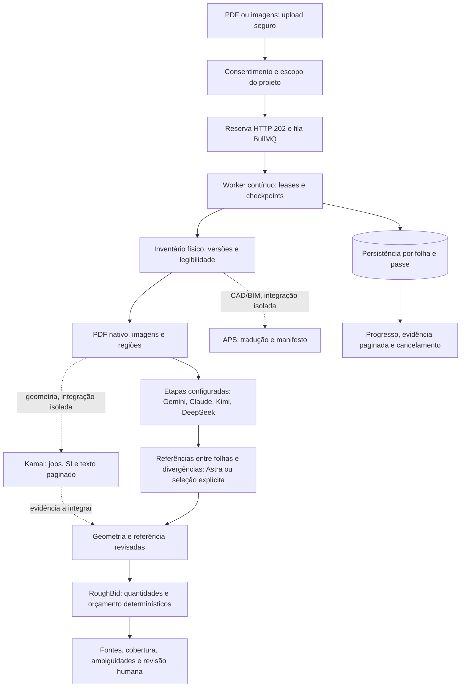

# RoughBid: motor por etapas — implementação isolada

> Este documento registra o primeiro marco `b8be810`. A entrega integrada de fotos, geometria revisada, orçamento, login, preços SaaS e QA está em [roughbid-delivery-2026-10-02.md](roughbid-delivery-2026-10-02.md); consulte esse relatório para o estado final e as lacunas atuais.

## Base e autorização

Branch local `agent/roughbid-stage-engine-20261002`, worktree separado do checkout do dono. Base: PR98 draft, commit `7dfb9c8edba456a19dcd1b964c1d1837319ebc80`; main remoto confirmado em `808e0b99a14477cb4a6525267e494c894e568766`. O checkout do dono estava em `3ce9947ab7ef8362ecd529db74cc9528e8731cf7`, com dois arquivos não versionados de segurança. Não foram copiados, removidos ou alterados. A PR99 altera somente a landing; esta branch não inclui essas mudanças.

Esta entrega é preparatória e revisável. Nenhum merge, push, deploy, SQL de produção, upload de planta ou chamada paga foi autorizado ou executado. Credenciais são cadastradas manualmente pelo dono. Os exemplos locais `.env*` não foram lidos, modificados ou incluídos na entrega. `.env.example` é rastreado pelo Git mesmo com ignore `.env*`: ignore não protege um arquivo já rastreado. Seu conteúdo local editado não é evidência de vazamento ou de cadastro em produção.

Consulta autorizada via Vercel CLI confirmou somente o cadastro relevante: `GEMINI_API_KEY`, tipo `Sensitive`, destino `Production`, projeto `ksp-dominion-group/roughbid`. Isso não comprova validade da chave, autorização do modelo ou release com a nova configuração. Não foi usado `env pull`, decrypt ou inferência autenticada. A consulta repetida filtrou a saída antes da exibição.

## Pipeline e limites

1. Autorização de workspace/projeto/arquivo e consentimento de IA antes de reservar trabalho.
2. Recepção HTTP curta com fila durável; processamento profundo em worker contínuo, Redis e checkpoints por página/passe.
3. Preflight PDF determinístico com manifesto físico e hashes; isolamento de uma página por chamada.
4. Registro explícito de fornecedor/modelo por etapa: classificação, legendas, geometria como evidência, disciplina, reconciliação, conflitos, cobertura, QA, composições como evidência e risco. Nenhum modelo desconhecido ou fallback automático abre uma chamada.
5. Medição numérica por geometria e escala verificadas; medições SI de Kamai são preservadas sem reaplicar escala. Checkpoint de linguagem não vira quantidade ou preço automaticamente.
6. `buildEvidenceBudget` une medições revisadas, revisão da página, composições explicitamente aprovadas e fontes de preço válidas ao cálculo determinístico `calculateEstimateV2`. Falta de medida/composição/preço/cobertura, revisão antiga ou conflito produz `estimate: null` e bloqueio. Material e mão de obra têm fontes próprias; desperdício e políticas são escolhas explícitas. O resultado exige revisão humana.
7. Kamai e APS possuem superfícies de integração isoladas e mocks. Não são ativados pela presença de uma chave. A ligação desses resultados ao banco/UI de medições, composições, revisões e orçamento ainda requer trabalho e validação próprios.

Não há limite total arbitrário de tempo para a leitura. O worker continua até concluir a cobertura aplicável ou registrar bloqueios/ambiguidades; nenhuma espera artificial é adicionada. Timeouts por tentativa, heartbeat, leases, cancelamento explícito e limites de gasto detectam falhas sem transformar cinco ou cinquenta minutos em término da análise. Passes com resultado incerto exigem reconciliação antes de repetição paga. Vercel `maxDuration: 300` limita a requisição, não a análise do worker. Não há prova de sucesso end-to-end em produção ou garantia de conclusão hoje.

O desenho inclui todos os fornecedores; somente a etapa explicitamente configurada chama um deles. A ordem inicial para benchmark é inventário local/Gemini → PDF nativo ou CAD/BIM/APS → geometria/Kamai e inspeção regional → Gemini visual detalhado e Claude para notas/legendas/especificações → Kimi para revisão independente de regiões selecionadas, DeepSeek para normalização/coerência → cálculos RoughBid → Astra para reconciliação de fontes → releitura dirigida de divergências. Essa atribuição precisa de comparação com plantas anotadas; não há superioridade ou precisão certificada por marca, votação de modelos ou tempo de processamento. A branch não automatiza ainda toda essa cadeia externa: as superfícies Kamai/APS e o orçamento com composição aguardam integração persistente.

PDF textual não comprova inspeção visual. Renderização e recortes são pré-condições das rotas Kimi/DeepSeek de imagem; a redução de imagem de DeepSeek Flash exige recortes em folhas densas. Texto extraído, OCR, caixas e referências precisam manter a página/região de origem. Um passe que chega ao limite de saída não pode declarar cobertura minuciosa completa; ele registra a necessidade de releitura/regiões adicionais. A concordância entre modelos não verifica escala ou dimensão.

## Trilha por fotos

A base PR98 inspecionada não contém processamento de fotos implementado; há indicação futura na ajuda. Isso diverge da opção relatada pelo dono e exige localizar/reconciliar a versão de produto que ele vê. Orçamento por fotos é o próximo passo imediato após o commit de plantas, em implementação separada nesta rodada. Contratos/guardrails isolados não são apresentados como funcionalidade pronta; o segundo percurso requer entrada autenticada, job persistido, adaptador, retorno e apresentação com mocks. Nenhum upload externo está autorizado.

Fluxo previsto: imagem segura → qualidade/perspectiva/oclusão/cobertura → ambiente, elementos e serviços visíveis → referência dimensional conhecida/informada/captura calibrada/profundidade realmente disponível → revisão por imagem/região → identidade revisada para evitar o mesmo objeto em várias fotos → quantitativo e composição com fonte. Foto monocular sem referência física não determina escala absoluta. EXIF, tamanho típico de porta e múltiplas fotos sem calibração não verificam medida. Partes ocultas permanecem desconhecidas. Intervalos/estimativas precisam conservar método, incerteza, referência e revisão e não são liberados como quantidade verificada. Preço ausente continua `missing_price`; o cálculo bloqueado tem `estimate: null`.

## Modelos e configuração sem segredos

| Fornecedor | ID oficial selecionável | Configuração existente | Limite |
|---|---|---|---|
| OpenAI | `gpt-6-astra` | `OPENAI_API_KEY`, `OPENAI_MODEL` | Responses, JSON estruturado; perfil máximo documentado configurável. Conta ainda não verificada. |
| Claude | `claude-opus-5-5`, `claude-fable-5-1` | `ANTHROPIC_API_KEY`, `CLAUDE_PLAN_MODEL`, `TAKEOFF_V2_CLAUDE_MODEL` | Adaptive thinking; sem forced tool choice. Fable exige escolha explícita. |
| Google | `gemini-3.1-pro-preview`, `gemini-3.8-flash` | `GEMINI_API_KEY`, `GEMINI_MODEL` | Pro Preview escolhido como início de benchmark pelo dono; Flash alternativa explícita. |
| Kimi | `kimi-k3`, `kimi-k2.6` | `KIMI_API_KEY`, `KIMI_BASE_URL`, `KIMI_MODEL` | Visão; região/endpoint explicitamente selecionados, imagens dependem de renderização e recortes. |
| DeepSeek | `deepseek-flash` visão; `deepseek-v4-pro` texto | `DEEPSEEK_API_KEY`, `DEEPSEEK_BASE_URL`, `DEEPSEEK_MODEL`, `DEEPSEEK_VISION_MODEL`, `DEEPSEEK_TEXT_MODEL` | Flash tem visão com redução de resolução; Pro recebe só texto/evidências, não substitui inspeção visual. |
| Kamai | API pública v0.1.0 | `KAMAI_API_KEY` | Desligado por padrão; uso de dados/OEM, idempotência, preço e multipágina pendentes. |
| APS | Model Derivative v2 | `APS_CLIENT_ID`, `APS_CLIENT_SECRET` | Desligado por padrão; CAD/BIM isolado, PDF mantém rota existente. Não recriar app ou trocar secret. |

Cadastro de chave ou seleção por voz não comprova acesso da conta, quota, tarifa, autorização de dados ou compatibilidade de release. Valores não pertencem a este documento, patches ou logs.

Configuração Full V2: `TAKEOFF_V2_ENABLED`, `TAKEOFF_V2_WORKER_ENABLED`, `TAKEOFF_V2_SCHEMA_VERSION=takeoff-v2-foundation-v1`, `REDIS_URL`. No worker, `TAKEOFF_V2_STAGE_PROVIDER_ENABLED`; por passe `TAKEOFF_V2_STAGE_<PASS>_ENABLED`, `_PROVIDER`, `_MODEL` e os controles documentados de esforço/saída. Chaves no ambiente Vercel não configuram automaticamente o worker externo.

`TAKEOFF_V2_MODEL_ATTESTATIONS_JSON` é um objeto por ID com conta/compatibilidade verificadas, referência de tarifa e exposição máxima por chamada revisada. Seu valor pertence à configuração manual, não a este documento. A reserva SQL real deve cobrir essa exposição antes de despachar. Nenhum atestado é criado automaticamente. O perfil máximo usa o maior esforço documentado da seleção explícita; não escolhe Fable ou outro modelo de custo maior por fallback.

Controles complementares Kimi/DeepSeek: `KIMI_PLAN_READING_ENABLED`, `KIMI_PRIVATE_PLAN_DATA_APPROVED`, `DEEPSEEK_PLAN_READING_ENABLED`, `DEEPSEEK_PRIVATE_PLAN_DATA_APPROVED`, `DEEPSEEK_TEXT_READING_ENABLED`; timeouts/saída por tentativa em `AI_PLAN_KIMI_*`, `AI_PLAN_DEEPSEEK_*`, `AI_PLAN_DEEPSEEK_TEXT_*`. Região Kimi é seleção explícita de endpoint oficial; nenhuma conta/região é inferida pela chave.

Kamai: `TAKEOFF_V2_KAMAI_ENABLED`, `TAKEOFF_V2_KAMAI_INTEGRATION_APPROVED`, `TAKEOFF_V2_KAMAI_DATA_OEM_AUTHORIZED`, `TAKEOFF_V2_KAMAI_SUCCESS_STATUS`, `TAKEOFF_V2_KAMAI_SUCCESS_STATUS_VERIFIED`. O schema deixa status livre: nenhum estado terminal, inclusive `SUCCEEDED`, é tomado como garantia contratual. Somente um candidato explicitamente atestado leva à validação do artefato, e o resultado continua sujeito à comprovação multipágina e escala/revisão. OCR usa `include_text=true`, `text_offset` e `text_total`, sem truncamento silencioso. APS: `TAKEOFF_V2_APS_ENABLED`, `TAKEOFF_V2_APS_INTEGRATION_APPROVED`, `TAKEOFF_V2_APS_DATA_AUTHORIZED`. Ambas dependem de implementação concreta dos stores injetados e leases do host antes de ligar ao produto.

Fontes oficiais consultadas em 02/10/2026: [OpenAI Astra](https://developers.openai.com/api/docs/models/gpt-6-astra), [Responses JSON](https://developers.openai.com/api/docs/guides/structured-outputs), [Claude Opus](https://platform.claude.com/docs/en/models/opus-5-5/overview), [Claude Fable](https://platform.claude.com/docs/en/models/fable-5-1/overview), [Claude structured output](https://platform.claude.com/docs/en/build-with-claude/structured-outputs), [Gemini Pro Preview](https://ai.google.dev/gemini-api/docs/models/gemini-3.1-pro-preview), [Gemini Flash](https://ai.google.dev/gemini-api/docs/models/gemini-3.8-flash), [Gemini JSON](https://ai.google.dev/gemini-api/docs/generate-content/structured-output), [Kamai OpenAPI](https://api.kamai.io/openapi.json), [Kamai API](https://kamai.io/developers/api), [APS OAuth](https://aps.autodesk.com/en/docs/oauth/v2/tutorials/get-2-legged-token/), [APS contrato](https://github.com/autodesk-platform-services/aps-sdk-openapi/blob/main/modelderivative/modelderivative.yaml).

Fontes adicionais: [OpenAI PDF](https://developers.openai.com/api/docs/guides/file-inputs), [Kimi K3](https://github.com/MoonshotAI/Kimi-K3), [Kimi visão](https://platform.kimi.ai/docs/guide/use-kimi-vision-model), [Kimi extração textual](https://platform.kimi.ai/docs/guide/use-kimi-api-for-file-based-qa), [DeepSeek visão](https://api-docs.deepseek.com/guides/vision/), [DeepSeek modelos/tarifas](https://api-docs.deepseek.com/quick_start/pricing/), [Gemini PDF](https://ai.google.dev/gemini-api/docs/document-processing), [Claude esforço](https://platform.claude.com/docs/en/build-with-claude/effort), [APS formatos](https://aps.autodesk.com/en/docs/model-derivative/v2/developers_guide/supported-translations/supported-translation/), [Vercel Functions](https://vercel.com/docs/functions/limitations). Citations Claude não é usada junto ao JSON estruturado; a evidência fica no schema RoughBid.

## Revisão de implantação

Manter flags Full/Kamai/APS desligadas. Inventariar ledger de migrations, relações/colunas, definições de RPC, grants e RLS por metadados, sem dados ou segredos. Não executar `supabase db push` às cegas: há migrations históricas não idempotentes e numeração duplicada. Reconciliar aplicação parcial antes de qualquer SQL.

Dependências do código, a aplicar somente se ausentes e após ensaio em staging:

1. Fundamentos legados de tenant/projeto/owner/admin/entitlement/ledger; depois `0023_durable_ai_plan_jobs.sql`, `0024_durable_ai_worker_capabilities.sql`, `0025_durable_ai_lease_alignment.sql`.
2. `20260910225937_takeoff_v2_foundation.sql`, `20260910233003_takeoff_v2_fk_indexes.sql`.
3. Fundação de gasto `0039`; `20260919142500_low_cost_ai_provider_spend.sql`, `20260924134500_openai_claude_provider_spend.sql`.
4. PR98: `20260925200000_exhaustive_plan_scan.sql`.
5. Nova migration Full durável desta branch por último, após revisão dos corpos de RPC, autorizações, leases, reservas e regressões legadas.

O contexto auditado informa funções duráveis/tabelas V2 ausentes no Supabase vivo, allowlist de gasto apenas Gemini e finalizadores limitados a 200 findings. Isso precisa ser reconfirmado por metadados antes da implantação. A migration PR98 amplia o caminho pago/admin; o finalizador Pilot ainda tem limite 200. As reservas de gasto e limites por chamada devem ser revisados para os modelos e passes selecionados. Custos desconhecidos retêm reserva, sem alegar custo zero. O aceite legado de finding continua gerando custo zero/missing_price; não é um orçamento com composição/fonte.

Depois de revisão e autorização específica: migrations reconciliadas com flags desligadas; worker/Redis contínuos; heartbeat/capacidades e transporte mock; revisão do release exato. Teste real de modelo/dados/gasto e ativação de flags exigem autorização distinta. Termos OEM/dados de Kamai, conclusão multipágina, preço, quota e latência continuam pendentes.

## Rollback

Desligar entrada de novos Full runs; drenar/cancelar/reconciliar trabalho ativo e gasto incerto. Reverter API/worker para o último commit compatível. Preservar schema aditivo, ledger, checkpoints, fontes e reservas. Não apagar tabelas, não executar down SQL destrutivo e não repetir passe pago com resultado incerto. Restaurar RPC antigo somente após todos os novos runs pararem e a compatibilidade das reservas ser revisada.

## Validação

Milestone de plantas: **950 testes offline passaram**: 676 API; 176 domínio/web/MCP; 98 SQL/Prisma/PGlite. TypeScript API do milestone e TypeScript explícito do worker passaram; build `npm run build:app` passou. O sandbox bloqueou inicialmente a leitura de ancestrais pelo esbuild; a execução local autorizada do build resolveu a restrição. A suite live foi excluída da suíte offline, e sua execução com ambos os controles live desligados confirmou **1 skip, 0 chamadas**.

Comandos equivalentes: `node --experimental-strip-types --test` sobre arquivos API, domínio/web/MCP selecionados; `node --test` sobre SQL/Prisma selecionados; `tsc --noEmit`; compilação TypeScript explícita de `scripts/worker.ts`; `npm run build:app`. A checagem do milestone exclui módulos de fotos em edição concorrente, que serão validados no segundo commit. Os testes incluem PDF sintético, fila/repositórios simulados, checkpoints e consulta de evidência, SQL executado em PGlite, retomada/cancelamento e dez horas simuladas sem encerramento por tempo. Isso é prova offline, não E2E real com fornecedor.

Nenhuma inferência real, upload externo ou teste cobrável foi executado. A informação do dono sobre até US$5 em cada provedor não é saldo verificado nem orçamento aprovado. Testes reais ficam desligados por padrão mesmo com chave presente; `ROUGH_BID_LIVE_TESTS_ENABLED` e `ROUGH_BID_LIVE_TEST_SPEND_APPROVED`, além de modelo/chave explícitos, são necessários para a trilha live e não foram ativados. Não executar essa trilha nesta rodada. O próximo passo autorizado é revisar/aplicar o patch em ambiente local; produção, dados externos e qualquer gasto continuam dependentes de aprovação concreta própria.
